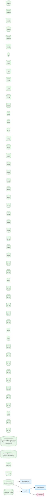

# Source-Level Data Flow

```mermaid
graph LR
    uf0[("-0.0004")]
    uf1[("-0.0066")]
    uf2[("-0.0179")]
    uf3[("-0.0207")]
    uf4[("-0.0265")]
    uf5[("-0.0383")]
    uf6[("0")]
    uf7[("0.0026")]
    uf8[("0.0152")]
    uf9[("0.0163")]
    uf10[("0.0188")]
    uf11[("0.0189")]
    uf12[("0.025")]
    uf13[("0.03")]
    uf14[("0.08")]
    uf15[("0.21")]
    uf16[("100.03")]
    uf17[("100.61")]
    uf18[("101.91")]
    uf19[("4884")]
    uf20[("4887")]
    uf21[("4899")]
    uf22[("4923")]
    uf23[("4930")]
    uf24[("4934")]
    uf25[("4941")]
    uf26[("4954")]
    uf27[("4957")]
    uf28[("5000")]
    uf29[("5001")]
    uf30[("5015")]
    uf31[("56.06")]
    uf32[("57.08")]
    uf33[("57.1")]
    uf34[("57.11")]
    uf35[("57.33")]
    uf36[("57.48")]
    uf37[("58.04")]
    uf38[("58.89")]
    uf39[("59.2")]
    uf40[("60.1")]
    uf41[("60.45")]
    uf42[("61.23")]
    uf43[("93.29")]
    uf44[("94.99")]
    uf45[("95.03")]
    uf46[("95.05")]
    uf47[("95.41")]
    uf48[("95.66")]
    uf49[("96.6")]
    uf50[("98.01")]
    uf51[("98.53")]
    uf52[("Provider=SQLOLEDB;Data Source=fin-db-01;Initial Catalog=Fina")]
    uf53[("Quarterly Revenue (Source: Bloomberg)")]
    uf54[("app.xml")]
    uf55[("core.xml")]
    uf56[("upstream_a.xlsx")]
    uf57[("upstream_b.xlsx")]
    ms0["Assumptions"]
    ms1["Calculations"]
    ms2["Inputs"]
    os0[["Summary"]]
    uf56 --> ms2
    uf57 --> ms2
    uf56 --> ms0
    ms2 --> ms1
    ms2 --> os0

    classDef upstream fill:#e8f5e9,stroke:#4caf50
    classDef model fill:#e3f2fd,stroke:#2196f3
    classDef output fill:#fce4ec,stroke:#e91e63
    class uf0 upstream
    class uf1 upstream
    class uf2 upstream
    class uf3 upstream
    class uf4 upstream
    class uf5 upstream
    class uf6 upstream
    class uf7 upstream
    class uf8 upstream
    class uf9 upstream
    class uf10 upstream
    class uf11 upstream
    class uf12 upstream
    class uf13 upstream
    class uf14 upstream
    class uf15 upstream
    class uf16 upstream
    class uf17 upstream
    class uf18 upstream
    class uf19 upstream
    class uf20 upstream
    class uf21 upstream
    class uf22 upstream
    class uf23 upstream
    class uf24 upstream
    class uf25 upstream
    class uf26 upstream
    class uf27 upstream
    class uf28 upstream
    class uf29 upstream
    class uf30 upstream
    class uf31 upstream
    class uf32 upstream
    class uf33 upstream
    class uf34 upstream
    class uf35 upstream
    class uf36 upstream
    class uf37 upstream
    class uf38 upstream
    class uf39 upstream
    class uf40 upstream
    class uf41 upstream
    class uf42 upstream
    class uf43 upstream
    class uf44 upstream
    class uf45 upstream
    class uf46 upstream
    class uf47 upstream
    class uf48 upstream
    class uf49 upstream
    class uf50 upstream
    class uf51 upstream
    class uf52 upstream
    class uf53 upstream
    class uf54 upstream
    class uf55 upstream
    class uf56 upstream
    class uf57 upstream
    class ms0 model
    class ms1 model
    class ms2 model
    class os0 output
```
