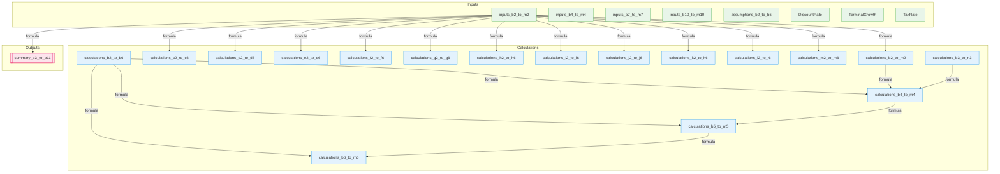

# Variable-Level Data Flow

```mermaid
graph TD
    subgraph Inputs
        v_2e07f6be1292["inputs_b2_to_m2"]
        v_0f1db2e64320["inputs_b4_to_m4"]
        v_91fa81a40d6c["inputs_b7_to_m7"]
        v_dc9d3a803c29["inputs_b10_to_m10"]
        v_9280cd42430c["assumptions_b2_to_b5"]
        v_6e9175fb4931["DiscountRate"]
        v_a43e667630ca["TerminalGrowth"]
        v_f3f2bdfef235["TaxRate"]
    end
    subgraph Calculations
        v_f9a6271a85f2["calculations_b2_to_b6"]
        v_6d0bd7c0b8b2["calculations_c2_to_c6"]
        v_a3a0e2e5b338["calculations_d2_to_d6"]
        v_d996e2379207["calculations_e2_to_e6"]
        v_c95645fdb477["calculations_f2_to_f6"]
        v_e5157807c179["calculations_g2_to_g6"]
        v_0c4090ecaf89["calculations_h2_to_h6"]
        v_89325ce5efb0["calculations_i2_to_i6"]
        v_0960768c161d["calculations_j2_to_j6"]
        v_9cbdcdb23d8a["calculations_k2_to_k6"]
        v_808652cfec3a["calculations_l2_to_l6"]
        v_9e83396bdac5["calculations_m2_to_m6"]
        v_16a725b1031b["calculations_b2_to_m2"]
        v_70193fa23d9a["calculations_b3_to_n3"]
        v_5a5deb6f7ab5["calculations_b4_to_m4"]
        v_852bc6b3b5e8["calculations_b5_to_m5"]
        v_fb2a13068770["calculations_b6_to_m6"]
    end
    subgraph Outputs
        v_faf018bc0449[["summary_b3_to_b11"]]
    end
    v_2e07f6be1292 -->|formula| v_16a725b1031b
    v_2e07f6be1292 -->|formula| v_6d0bd7c0b8b2
    v_2e07f6be1292 -->|formula| v_a3a0e2e5b338
    v_2e07f6be1292 -->|formula| v_d996e2379207
    v_2e07f6be1292 -->|formula| v_c95645fdb477
    v_2e07f6be1292 -->|formula| v_e5157807c179
    v_2e07f6be1292 -->|formula| v_0c4090ecaf89
    v_2e07f6be1292 -->|formula| v_89325ce5efb0
    v_2e07f6be1292 -->|formula| v_0960768c161d
    v_2e07f6be1292 -->|formula| v_9cbdcdb23d8a
    v_2e07f6be1292 -->|formula| v_808652cfec3a
    v_2e07f6be1292 -->|formula| v_9e83396bdac5
    v_f9a6271a85f2 -->|formula| v_5a5deb6f7ab5
    v_16a725b1031b -->|formula| v_5a5deb6f7ab5
    v_70193fa23d9a -->|formula| v_5a5deb6f7ab5
    v_f9a6271a85f2 -->|formula| v_852bc6b3b5e8
    v_5a5deb6f7ab5 -->|formula| v_852bc6b3b5e8
    v_f9a6271a85f2 -->|formula| v_fb2a13068770
    v_852bc6b3b5e8 -->|formula| v_fb2a13068770
    v_2e07f6be1292 -->|formula| v_faf018bc0449

    classDef input fill:#e8f5e9,stroke:#4caf50
    classDef intermediate fill:#e3f2fd,stroke:#2196f3
    classDef output fill:#fce4ec,stroke:#e91e63
    class v_2e07f6be1292 input
    class v_0f1db2e64320 input
    class v_91fa81a40d6c input
    class v_dc9d3a803c29 input
    class v_9280cd42430c input
    class v_6e9175fb4931 input
    class v_a43e667630ca input
    class v_f3f2bdfef235 input
    class v_f9a6271a85f2 intermediate
    class v_6d0bd7c0b8b2 intermediate
    class v_a3a0e2e5b338 intermediate
    class v_d996e2379207 intermediate
    class v_c95645fdb477 intermediate
    class v_e5157807c179 intermediate
    class v_0c4090ecaf89 intermediate
    class v_89325ce5efb0 intermediate
    class v_0960768c161d intermediate
    class v_9cbdcdb23d8a intermediate
    class v_808652cfec3a intermediate
    class v_9e83396bdac5 intermediate
    class v_16a725b1031b intermediate
    class v_70193fa23d9a intermediate
    class v_5a5deb6f7ab5 intermediate
    class v_852bc6b3b5e8 intermediate
    class v_fb2a13068770 intermediate
    class v_faf018bc0449 output
```
