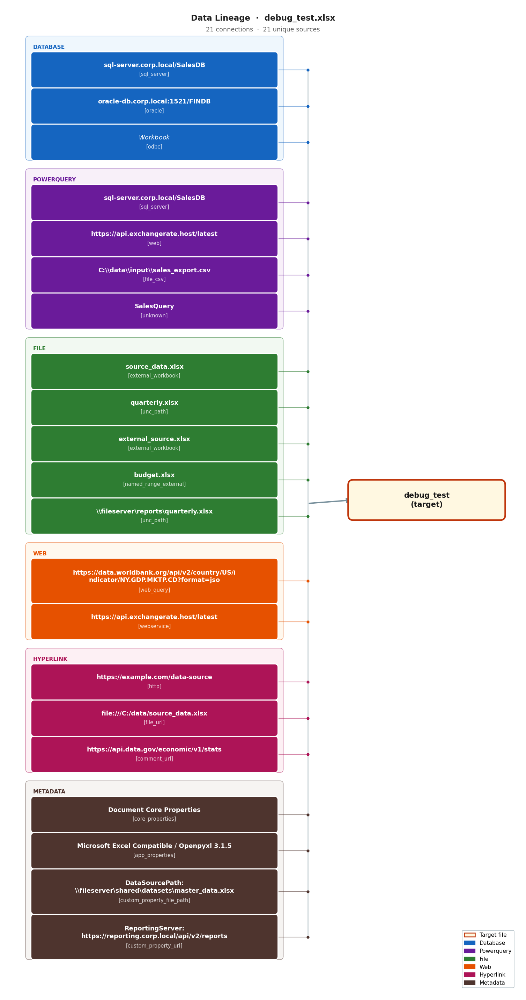

# ExcelLineageDetector

Forensically extract every data connection hidden inside an Excel file — databases, Power Query, VBA, formulas, pivot tables, hyperlinks, comments, and more — and produce a JSON report, a formatted Excel workbook, and a visual lineage graph.

Also includes an **upstream tracer** that identifies where hardcoded values were copy-pasted from by matching against source files, and **recursive formula tracing** that follows external workbook references through multiple levels.

## Outputs

### Lineage Detection

For an input file `report.xlsx`, the detector writes three files:

| File | Description |
|---|---|
| `report_lineage.json` | Full structured extraction, machine-readable |
| `report_lineage_report.xlsx` | Human-readable report: "All Connections" sheet + per-sheet hardcoded vector sheets |
| `report_lineage_graph.png` | Hierarchical visual map of data flow into the file |

### Upstream Tracing

For a model file traced against upstream sources:

| File | Description |
|---|---|
| `upstream_tracing_<name>.xlsx` | Config sheet + Tracing Results (value matches) + Level 1, 2, ... (formula tracing) |
| `upstream_tracing_<name>_mermaid.md` | Mermaid flowchart showing file/sheet/range connections across levels |

## Installation

**Python 3.10+ required.**

```bash
# Clone the repo
git clone https://github.com/your-org/ExcelLineageDetector.git
cd ExcelLineageDetector

# Create and activate a virtual environment
python3 -m venv .venv
source .venv/bin/activate        # Linux / macOS
# .venv\Scripts\activate         # Windows

# Install dependencies
pip install -r requirements.txt
```

## Usage

### Lineage Detection

```bash
python detect_lineage.py path/to/file.xlsx
```

All three output files are written to the same directory as the input file by default.

```
python detect_lineage.py <file> [options]

positional arguments:
  file              Path to Excel file (.xlsx, .xlsm, .xlsb)

options:
  --out-dir DIR     Write outputs to DIR instead of the input file's directory
  --json-only       Skip the Excel report and PNG graph (faster)
  --verbose, -v     Enable debug logging
```

### Upstream Tracing

```bash
# List sheets in the model file
python trace_upstream.py model.xlsx --list-sheets

# Trace one sheet against upstream files in a directory
python trace_upstream.py model.xlsx --sheet "Revenue" --upstream-dir ./sources/

# Trace against specific files with custom config
python trace_upstream.py model.xlsx --sheet "Revenue" \
    --upstream source1.xlsx source2.xlsx --config my_config.json

# Limit formula tracing depth, or disable it
python trace_upstream.py model.xlsx --sheet "Revenue" --upstream-dir ./sources/ --max-level 3
python trace_upstream.py model.xlsx --sheet "Revenue" --upstream-dir ./sources/ --no-formula-tracing

# Verbose output and custom output directory
python trace_upstream.py model.xlsx --sheet "Revenue" --upstream-dir ./sources/ \
    --out-dir ./results --verbose

# Convert the tracing report into a Mermaid flowchart
python trace_upstream_mermaid.py upstream_tracing_model.xlsx
python trace_upstream_mermaid.py upstream_tracing_model.xlsx --lr -o diagram.md
```

## What Gets Detected

| Source | Where it hides |
|---|---|
| Database connections | `xl/connections.xml` (ODBC, OLE DB, OLAP) |
| Power Query (M code) | `xl/customXml/item0.xml`, connection names |
| Cross-workbook formulas | Cell formulas: `='[source.xlsx]Sheet1'!A1` |
| UNC / local file paths | Cell formulas with `\\server\share\[file.xlsx]` |
| WEBSERVICE / RTD | Live-data formula functions |
| Bloomberg / Reuters / FactSet | Proprietary add-in formulas (`BDP`, `BDH`, `RHistory`, `FDS`, etc.) |
| VBA (ADODB, SQL, HTTP) | `xl/vbaProject.bin` decompiled with olevba |
| Pivot table sources | `xl/pivotCache/pivotCacheDefinition*.xml` |
| Query tables | `xl/queryTables/` with embedded SQL |
| Hyperlinks | External URLs and file paths in cells |
| Named ranges | External workbook references in defined names |
| Comments | URLs and file paths embedded in cell notes |
| Document properties | `docProps/core.xml`, `app.xml`, `custom.xml` |
| Linked OLE objects | External file links in drawings/relationships |
| Hardcoded values | Cells with numeric values and no formula (copy-pasted data) |
| Hidden sheets | Same extraction, regardless of sheet visibility |

## Running the Tests

```bash
# Run all tests (53 total)
python -m pytest tests/ -v

# Run only the detector coverage test
python -m pytest tests/test_detector.py::test_coverage -v -s

# Run only the upstream tracing tests
python -m pytest tests/test_tracing.py -v
```

The coverage test programmatically generates a tricky Excel file with planted connections across every supported category and verifies the detector finds at least 60% of them. Current coverage: **100%**.

The tracing tests cover: config loading, streaming scanner, exact/approximate matchers, batch similarity kernels, end-to-end tracing, formula tracer (helpers, streaming parser, cell filter, regex, file resolution, multi-level recursion), and report generation.

## Project Structure

```
detect_lineage.py          CLI — lineage detection
trace_upstream.py          CLI — upstream value tracing + formula tracing
trace_upstream_mermaid.py  CLI — convert tracing report to Mermaid flowchart
tracing_config.json        Default config for upstream tracing
requirements.txt
lineage/
  detector.py              Orchestrator — runs all extractors, deduplicates
  models.py                DataConnection and ParsedQuery dataclasses
  utils.py                 Logging helpers
  hardcoded_scanner.py     Fast streaming vector scanner (lxml iterparse)
  extractors/              One module per connection source type (13 total)
  parsers/                 SQL (sqlglot), Power Query M, formula ref, connection string
  reporters/
    json_reporter.py       Writes _lineage.json
    excel_reporter.py      Writes _lineage_report.xlsx
    graph_reporter.py      Writes _lineage_graph.png
  tracing/                 Upstream tracing module
    config.py              TraceConfig dataclass + JSON/YAML loader
    models.py              TracingVector, VectorMatch dataclasses
    scanner.py             Streaming XML parsers (model + upstream)
    exact_matcher.py       Hash-based lookup + batched numpy subsequence
    approx_matcher.py      Vectorized similarity (Pearson/cosine/Euclidean)
    tracer.py              Orchestrator with parallel upstream scanning
    formula_tracer.py      Recursive external formula reference tracing
    report.py              Excel report: Config + Tracing Results + Level N sheets
tests/
  test_generator.py        Programmatically builds a test .xlsx with planted connections
  test_detector.py         19 tests — detection coverage and all reporters
  test_tracing.py          34 tests — upstream tracing and formula tracing
  fixtures/                Generated test files (git-ignored)
```

## Documentation

| File | Description |
|---|---|
| `use.md` | Detailed user guide: running, report format, configuration |
| `upstream_algorithm.md` | Algorithm docs: scanning, matching, formula tracing, complexity analysis |
| `CLAUDE.md` | Developer guide for Claude Code / AI-assisted development |

## Sample Graph Output

The PNG graph groups sources by category on the left, with all connections flowing through a bus line to the target Excel file on the right.


