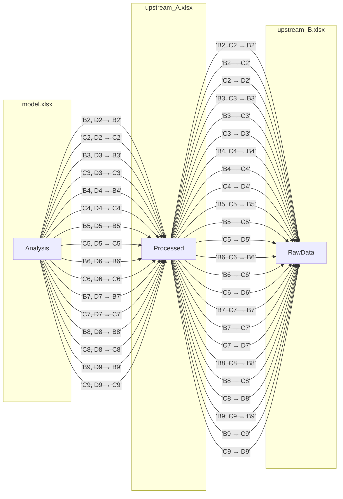

```mermaid
flowchart LR
    subgraph f_model_xlsx["model.xlsx"]
        s_model_xlsx_Analysis["Analysis"]
    end
    subgraph f_upstream_A_xlsx["upstream_A.xlsx"]
        s_upstream_A_xlsx_Processed["Processed"]
    end
    subgraph f_upstream_B_xlsx["upstream_B.xlsx"]
        s_upstream_B_xlsx_RawData["RawData"]
    end

    s_model_xlsx_Analysis -->|"'B2, D2 → B2'"| s_upstream_A_xlsx_Processed
    s_model_xlsx_Analysis -->|"'C2, D2 → C2'"| s_upstream_A_xlsx_Processed
    s_model_xlsx_Analysis -->|"'B3, D3 → B3'"| s_upstream_A_xlsx_Processed
    s_model_xlsx_Analysis -->|"'C3, D3 → C3'"| s_upstream_A_xlsx_Processed
    s_model_xlsx_Analysis -->|"'B4, D4 → B4'"| s_upstream_A_xlsx_Processed
    s_model_xlsx_Analysis -->|"'C4, D4 → C4'"| s_upstream_A_xlsx_Processed
    s_model_xlsx_Analysis -->|"'B5, D5 → B5'"| s_upstream_A_xlsx_Processed
    s_model_xlsx_Analysis -->|"'C5, D5 → C5'"| s_upstream_A_xlsx_Processed
    s_model_xlsx_Analysis -->|"'B6, D6 → B6'"| s_upstream_A_xlsx_Processed
    s_model_xlsx_Analysis -->|"'C6, D6 → C6'"| s_upstream_A_xlsx_Processed
    s_model_xlsx_Analysis -->|"'B7, D7 → B7'"| s_upstream_A_xlsx_Processed
    s_model_xlsx_Analysis -->|"'C7, D7 → C7'"| s_upstream_A_xlsx_Processed
    s_model_xlsx_Analysis -->|"'B8, D8 → B8'"| s_upstream_A_xlsx_Processed
    s_model_xlsx_Analysis -->|"'C8, D8 → C8'"| s_upstream_A_xlsx_Processed
    s_model_xlsx_Analysis -->|"'B9, D9 → B9'"| s_upstream_A_xlsx_Processed
    s_model_xlsx_Analysis -->|"'C9, D9 → C9'"| s_upstream_A_xlsx_Processed
    s_upstream_A_xlsx_Processed -->|"'B2, C2 → B2'"| s_upstream_B_xlsx_RawData
    s_upstream_A_xlsx_Processed -->|"'B2 → C2'"| s_upstream_B_xlsx_RawData
    s_upstream_A_xlsx_Processed -->|"'C2 → D2'"| s_upstream_B_xlsx_RawData
    s_upstream_A_xlsx_Processed -->|"'B3, C3 → B3'"| s_upstream_B_xlsx_RawData
    s_upstream_A_xlsx_Processed -->|"'B3 → C3'"| s_upstream_B_xlsx_RawData
    s_upstream_A_xlsx_Processed -->|"'C3 → D3'"| s_upstream_B_xlsx_RawData
    s_upstream_A_xlsx_Processed -->|"'B4, C4 → B4'"| s_upstream_B_xlsx_RawData
    s_upstream_A_xlsx_Processed -->|"'B4 → C4'"| s_upstream_B_xlsx_RawData
    s_upstream_A_xlsx_Processed -->|"'C4 → D4'"| s_upstream_B_xlsx_RawData
    s_upstream_A_xlsx_Processed -->|"'B5, C5 → B5'"| s_upstream_B_xlsx_RawData
    s_upstream_A_xlsx_Processed -->|"'B5 → C5'"| s_upstream_B_xlsx_RawData
    s_upstream_A_xlsx_Processed -->|"'C5 → D5'"| s_upstream_B_xlsx_RawData
    s_upstream_A_xlsx_Processed -->|"'B6, C6 → B6'"| s_upstream_B_xlsx_RawData
    s_upstream_A_xlsx_Processed -->|"'B6 → C6'"| s_upstream_B_xlsx_RawData
    s_upstream_A_xlsx_Processed -->|"'C6 → D6'"| s_upstream_B_xlsx_RawData
    s_upstream_A_xlsx_Processed -->|"'B7, C7 → B7'"| s_upstream_B_xlsx_RawData
    s_upstream_A_xlsx_Processed -->|"'B7 → C7'"| s_upstream_B_xlsx_RawData
    s_upstream_A_xlsx_Processed -->|"'C7 → D7'"| s_upstream_B_xlsx_RawData
    s_upstream_A_xlsx_Processed -->|"'B8, C8 → B8'"| s_upstream_B_xlsx_RawData
    s_upstream_A_xlsx_Processed -->|"'B8 → C8'"| s_upstream_B_xlsx_RawData
    s_upstream_A_xlsx_Processed -->|"'C8 → D8'"| s_upstream_B_xlsx_RawData
    s_upstream_A_xlsx_Processed -->|"'B9, C9 → B9'"| s_upstream_B_xlsx_RawData
    s_upstream_A_xlsx_Processed -->|"'B9 → C9'"| s_upstream_B_xlsx_RawData
    s_upstream_A_xlsx_Processed -->|"'C9 → D9'"| s_upstream_B_xlsx_RawData

    classDef missing fill:#FFCDD2,stroke:#C62828,stroke-width:2px,color:#B71C1C
    classDef found fill:#C8E6C9,stroke:#2E7D32,stroke-width:1px
```
