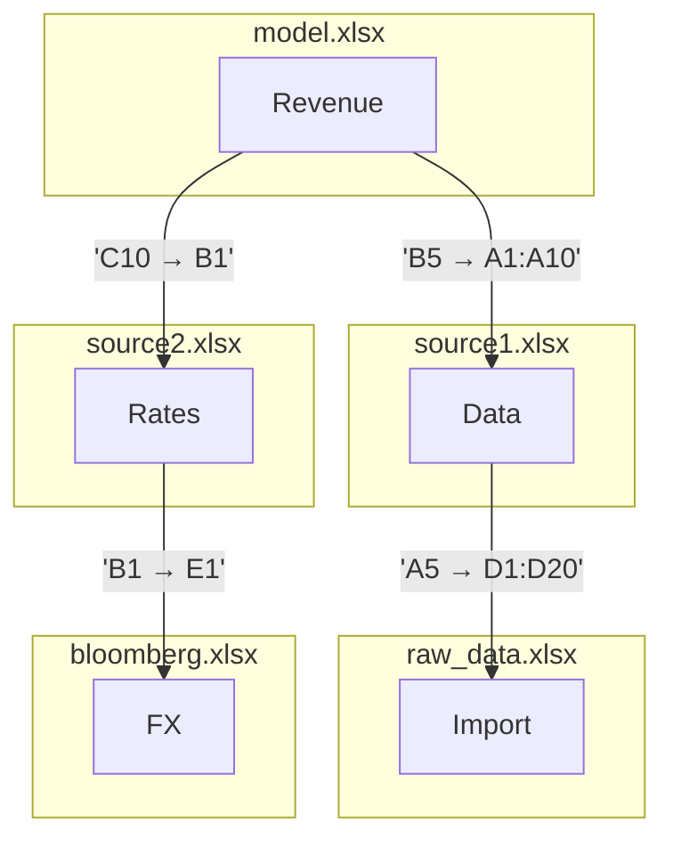

# Excel Lineage Detector — User Guide

## What it does

Point it at any Excel file and it produces three outputs:

| Output | What it contains |
|--------|-----------------|
| `<name>_lineage_report.xlsx` | Formatted Excel report (see below) |
| `<name>_lineage.json` | Full machine-readable results |
| `<name>_lineage_graph.png` | Visual dependency graph |

---

## Requirements

- Python 3.10+
- A virtual environment with dependencies installed:

```bash
python -m venv .venv
source .venv/bin/activate          # Windows: .venv\Scripts\activate
pip install -r requirements.txt
```

Supported file formats: `.xlsx`, `.xlsm` (macro-enabled). `.xls` files are partially supported (connections and formulas are detected; hardcoded vector scanning is skipped because `.xls` is a binary format, not a ZIP archive).

---

## Running it

```bash
# Basic — writes all three outputs next to the input file
.venv/bin/python detect_lineage.py path/to/workbook.xlsx

# Send outputs to a specific folder
.venv/bin/python detect_lineage.py workbook.xlsx --out-dir ./results

# JSON only (fastest — skips the Excel report and graph)
.venv/bin/python detect_lineage.py workbook.xlsx --json-only

# Verbose logging (shows which extractor found what)
.venv/bin/python detect_lineage.py workbook.xlsx --verbose
```

Terminal output looks like:

```
Scanning: /data/Indigo.xlsx
Found 1721 connection(s)
  formula: 1654
  input: 42
  hyperlink: 15
  metadata: 10
JSON:  /data/Indigo_lineage.json
Excel: /data/Indigo_lineage_report.xlsx
Graph: /data/Indigo_lineage_graph.png
```

---

## Understanding the Excel report

The report has **one sheet per sheet in your original workbook, plus one "All Connections" sheet at the front**.

### Sheet 1 — All Connections

Every detected data connection in a single filterable table:

| Column | Description |
|--------|-------------|
| ID | Unique fingerprint (SHA-256 of category + location + raw value) |
| Category | `database`, `file`, `web`, `powerquery`, `vba`, `formula`, `pivot`, `hyperlink`, `ole`, `metadata`, `input` |
| Sub-type | Granular type: `sql_server`, `bloomberg`, `sharepoint_workbook`, `named_input`, etc. |
| Source | Human-readable label |
| Location | Where it was found: `Sheet1!A10`, `VBA:Module1:42`, `connections.xml`, etc. |
| Query/Formula | SQL query text or formula snippet (truncated to 200 chars) |
| Confidence | 0.0–1.0. 1.0 = definitive (e.g. an ODBC connection string). Lower = inferred (e.g. a cell that looks like a pasted value) |
| Raw Connection | Full connection string, URL, file path, or cell value |

Rows are colour-coded by category. Use Excel's built-in AutoFilter (the dropdown arrows) to filter by category, sub-type, or sheet.

### Sheets 2-N — Hardcoded Value Vectors (one per original sheet)

Each sheet is named after the corresponding sheet in your workbook and lists every **vector** of hardcoded numeric values found there.

A **vector** is a contiguous run of cells — in a single column or row — that contain plain numbers with no formula. These are the cells most likely to represent data that was copy-pasted from Bloomberg, a database export, a PDF, or another Excel file.

| Column | Description |
|--------|-------------|
| Sheet Name | Which sheet the vector lives on |
| Cell Range | Excel range notation, e.g. `B3:B15` or `C5:M5` |
| Direction | `column` (data runs down) or `row` (data runs across) |
| Length | Number of cells in the run |
| Start Cell | First cell, e.g. `B3` |
| End Cell | Last cell, e.g. `B15` |
| Sample Values | First 5 values, with a count of how many more follow |

**Row colour coding:**
- Blue rows = column-direction vectors (a series running down a column — typical for time-series: monthly/quarterly/annual data stacked vertically)
- Green rows = row-direction vectors (a series running across a row — typical for cross-sectional data: multiple companies or line items side by side)

If a sheet has no hardcoded value vectors (e.g. it's pure formulas or labels), the sheet will say *"No hardcoded value vectors found in this sheet."*

#### Example

Suppose `Revenue Model` in your workbook contains this block with no formulas:

```
     B       C       D       E
 5  2021    2022    2023    2024     ← row vector B5:E5 (len=4, direction=row)
 6  1200    1450    1680    1910     ← row vector B6:E6 (len=4)
 7   820     910     990    1050     ← row vector B7:E7 (len=4)
```

Column B also forms a column vector B5:B7 (len=3, direction=column), and similarly for C, D, E.

The report will list all of these, letting you identify exactly which ranges were entered manually and may need to be traced back to a source.

---

## What gets detected (beyond hardcoded vectors)

The tool inspects every region of the Excel ZIP archive:

| What | How it shows up |
|------|----------------|
| ODBC / OLE DB connections | `database` category, connection string + SQL in "Raw Connection" and "Query/Formula" |
| Power Query (M code) | `powerquery` category, each data source in the M script is a separate row |
| External workbook links | `file` or `formula` category, full path or SharePoint URL |
| VBA macros that fetch data | `vba` category, code snippet showing ADODB / XMLHTTPRequest calls |
| Bloomberg / Reuters / FactSet formulas | `formula` category, sub-type = `bloomberg` / `reuters` / `factset` |
| Pivot table cache sources | `pivot` category |
| Hyperlinks | `hyperlink` category |
| Named ranges pointing outside the file | `file` category |
| Source-attribution text ("Source: Bloomberg") | `input` category, sub-type = `source_note` |
| Document metadata (author, file paths in custom properties) | `metadata` category |

---

## Tips for large workbooks

- Use `--json-only` if you only need the machine-readable data. The JSON reporter is the fastest output; the Excel report takes longer because openpyxl writes each cell individually.
- The hardcoded vector scan is streaming (see below) and adds negligible time even on large files.
- `.xls` files take longer overall because openpyxl must load the entire binary workbook into memory. Vector scanning is skipped for `.xls`.

---

## How the hardcoded vector scan is fast

**Short answer:** it uses streaming XML parsing, not calamine, and not openpyxl.

Every `.xlsx`/`.xlsm` file is a ZIP archive. The cell data lives in `xl/worksheets/sheet1.xml`, `sheet2.xml`, etc. Those XML files can be tens of megabytes for large models.

The scanner reads each sheet XML using **`lxml.etree.iterparse`** — a streaming parser that processes one XML element at a time and immediately discards it from memory. It never builds a full DOM tree. For a sheet with 500,000 cells it holds roughly the same amount of memory as for a sheet with 100 cells.

Each cell element (`<c>`) is inspected for two things:
1. Does it have a `<f>` child? → formula; skip it.
2. Does it have a `<v>` child with a numeric value and no `<f>`? → hardcoded numeric; keep it.

After collecting all hardcoded cell positions, consecutive positions in the same column or row are grouped into runs in a single O(n) pass.

**Why not calamine?** [`python-calamine`](https://github.com/dimastbk/python-calamine) is a Rust-based reader and is excellent for reading computed cell values very fast. However, it only exposes final values — it does not tell you whether a value came from a formula or was typed directly. Distinguishing hardcoded from formula-derived values requires inspecting the raw XML, which is exactly what iterparse does. Using calamine would require a second pass over the XML anyway, so iterparse in a single pass is both simpler and faster.

**Benchmark on 10 real financial XLSX files (ExcelFiles/):**

| File | Sheets | Vectors found | Scan time |
|------|--------|---------------|-----------|
| ACC-Ltd.xlsx (64 KB) | 9 | 180 | 35 ms |
| Bharti-Airtel (187 KB) | 11 | 357 | 162 ms |
| Indigo.xlsx (189 KB) | 13 | 623 | 82 ms |
| Cash flow model (326 KB) | 8 | 58 | 19 ms |
| Loan calculator (52 KB) | 1 | 16 | 11 ms |
| **Total (10 files)** | **69 sheets** | **1,723** | **494 ms** |

The scan time above is purely the vector scanner. The overall run time is dominated by openpyxl loading the workbook for the other extractors (formula parsing, pivot tables, etc.).

---

## Upstream Tracing — finding where values came from

If you have a model file with hardcoded values and a set of potential source files, the upstream tracer identifies which source file, sheet, and cell range each hardcoded vector was likely copied from.

### Quick start

```bash
# List sheets in the model file
.venv/bin/python trace_upstream.py model.xlsx --list-sheets

# Trace one sheet against specific upstream files
.venv/bin/python trace_upstream.py model.xlsx --sheet "Revenue" \
    --upstream source1.xlsx source2.xlsx

# Trace against all xlsx files in a directory
.venv/bin/python trace_upstream.py model.xlsx --sheet "Revenue" \
    --upstream-dir ./upstream_files/

# With verbose output and custom output directory
.venv/bin/python trace_upstream.py model.xlsx --sheet "Revenue" \
    --upstream-dir ./upstream_files/ --out-dir ./results --verbose

# Use a custom config
.venv/bin/python trace_upstream.py model.xlsx --sheet "Revenue" \
    --upstream source.xlsx --config my_config.json
```

Terminal output:

```
Model:    model.xlsx -> sheet 'Assumptions Sheet'
Upstream: 9 file(s)
Scanning model sheet 'Assumptions Sheet' in model.xlsx ...
  Found 91 hardcoded vectors
Scanning 9 upstream file(s) with 9 worker(s) ...
  Upstream scan: 3196 vectors in 0.22s
  Done: 2 exact + 435 approximate matches for 91 vectors (0.92s)

Results: 91 model vectors
  Exact matches:       2
  Approximate matches: 435
  Unmatched vectors:   4

Formula tracing: 2 level(s), 14 external ref(s) (10 found, 4 missing)

Report: ./results/upstream_tracing_model.xlsx
```

### Understanding the report

The output file `upstream_tracing_<name>.xlsx` has the following sheets:

**Config** — lists all settings and summary statistics.

**Tracing Results** — one row per match (value-based tracing):

*If formula tracing finds external references, additional sheets are appended:*

**Level 1, Level 2, ...** — one sheet per recursion depth showing formulas that reference external workbooks (see [Formula-Based Recursive Tracing](#formula-based-recursive-tracing) below).

#### Tracing Results columns

| Column | Description |
|--------|-------------|
| Model Range | Cell range in the model sheet (e.g. `B3:B15`) |
| Model Direction | `column` or `row` |
| Model Length | Number of cells |
| Match Rank | 1 = best match for this vector, 2 = second best, etc. |
| Match Type | `exact` (identical values), `exact_subsequence` (model is a subset of upstream), or `approximate` (similar shape) |
| Similarity | 1.0 for exact, <1.0 for approximate |
| Upstream File | Which source file the match was found in |
| Upstream Sheet | Which sheet |
| Upstream Range / Matched Range | Where in the upstream file |

**Row colours:**
- Green = exact match
- Light green = exact subsequence match
- Blue = approximate match (darker blue = higher similarity)
- Yellow = no match found

### How matching works

**Exact matching**: The model vector's values (rounded to 8 decimal places) are looked up in a hash index of all upstream vectors. O(1) per lookup. Also checks if the model vector appears as a contiguous subsequence within longer upstream vectors using batched numpy sliding windows.

**Approximate matching**: Uses Pearson correlation (default) to find upstream vectors with similar "shape" regardless of scale. Supports length-mismatched vectors — a model vector of length 10 can match against an upstream vector of length 15 by sliding a window. All computations are fully vectorized with numpy.

### Configuration

Edit `tracing_config.json` (created automatically with defaults):

```json
{
  "matching": {
    "exact": true,
    "approximate": true,
    "top_n": 5,
    "similarity_metric": "pearson",
    "min_similarity": 0.8,
    "subsequence_matching": true,
    "length_tolerance_pct": 50.0,
    "direction_sensitive": false
  },
  "performance": {
    "max_workers": null,
    "min_vector_length": 3
  }
}
```

| Setting | What it does |
|---------|-------------|
| `exact` / `approximate` | Enable or disable each matching mode |
| `top_n` | How many approximate matches to show per vector (ignored if `approximate=false`) |
| `similarity_metric` | `pearson` (default, scale-invariant), `cosine`, or `euclidean` |
| `min_similarity` | Minimum score to report an approximate match (0.0–1.0) |
| `subsequence_matching` | Allow model vector to match a slice of a longer upstream vector |
| `length_tolerance_pct` | Allow ±N% length mismatch in approximate mode (50 = model length 10 matches upstream 5–15) |
| `direction_sensitive` | `false` = column vectors can match row vectors (transposed paste) |
| `max_workers` | Parallel workers for upstream scanning (`null` = auto) |

### Performance

Upstream scanning uses parallel processing (`ProcessPoolExecutor`). All matching uses batched numpy operations — no Python-level per-vector loops. Typical performance:

| Phase | Time |
|-------|------|
| Scan model sheet | <10ms |
| Scan 9 upstream files (parallel) | ~220ms |
| Matching (exact + approximate) | ~500ms |
| **Total (91 vectors × 3,196 upstream)** | **~920ms** |

### Supported formats

- **Model file**: `.xlsx`, `.xlsm` (ZIP-based formats)
- **Upstream files**: `.xlsx`, `.xlsm` only (`.xls` files are skipped with a warning)

### Algorithm details

See `upstream_algorithm.md` for the full algorithm documentation including complexity analysis, similarity metrics, and optimization strategies.

---

## Formula-Based Recursive Tracing

In addition to hardcoded value matching, `trace_upstream.py` performs **recursive formula-based tracing** — following formulas that reference external Excel workbooks through multiple levels until the upstream file is no longer found on disk.

### How it works

**Level 1**: Scans ALL cells in the model file for formulas referencing external workbooks (e.g. `'[budget.xlsx]Revenue'!A1:A10` or `[1]Sheet1!B5`). Records source cell, target file, sheet, and range.

**Level 2+**: For each upstream file found at Level 1, scans ONLY the cell ranges referenced at Level 1 (not the entire file) for further external references. Continues recursively.

**Stops when**: No new upstream files are found, the referenced file doesn't exist on disk, or `--max-level` is reached.

### Usage

```bash
# Formula tracing is automatic (runs alongside value tracing)
.venv/bin/python trace_upstream.py model.xlsx --sheet "Revenue" \
    --upstream-dir ./data/

# Disable formula tracing (value matching only)
.venv/bin/python trace_upstream.py model.xlsx --sheet "Revenue" \
    --upstream-dir ./data/ --no-formula-tracing

# Limit recursion depth
.venv/bin/python trace_upstream.py model.xlsx --sheet "Revenue" \
    --upstream-dir ./data/ --max-level 3
```

### Report output

Formula tracing results are added to the same `upstream_tracing_<name>.xlsx` report:

- **Level 1** tab — all external formula references from the model file
- **Level 2** tab — external references found in Level 1's target cells
- **Level N** tab — continues recursively

Each row in a Level sheet:

| Column | Description |
|--------|-------------|
| Source File | File containing the formula |
| Source Sheet | Sheet containing the formula |
| Source Cell | Cell reference (e.g. `A1`) |
| Formula | Formula text (truncated to 300 chars) |
| Target File | Referenced workbook filename |
| Target Sheet | Referenced sheet name |
| Target Range | Referenced cell range |
| Target Path | Full path from formula/rels (for display) |
| File Found | Yes/No |
| Resolved Path | Actual disk path if found |
| Precedent Chain | How the source cell transitively depends on the external file (see below) |

**Row colours:**
- **Green** = target file found on disk
- **Red/salmon** = target file NOT found (chain stops here)

### Transitive precedent walking

A target cell may not directly reference an external file — it might depend on other cells within the same workbook that do. For example:

```
upstream.xlsx:
  Data!A1 = B1 * 2           ← A1 does NOT reference an external file
  Data!B1 = C1 + 100         ← B1 does NOT reference an external file
  Data!C1 = '[source.xlsx]Raw'!D5  ← C1 DOES reference an external file
```

If the model file references `upstream.xlsx!Data!A1`, the tracer follows the in-workbook precedent chain `A1 → B1 → C1` until it finds the external reference to `source.xlsx`. The **Precedent Chain** column shows this as:

```
Data!B1 (=C1+100) → Data!C1 (='[source.xlsx]Raw'!D5)
```

This works across sheets within the same workbook, handles chains of arbitrary depth (up to 20 hops), safely terminates on circular references, and expands range references like `SUM(B1:B10)`.

For direct external references (where the source cell itself contains `[file.xlsx]`), the Precedent Chain column shows `(direct)`.

### External reference resolution

Formulas may reference files by literal name (`'[budget.xlsx]Sheet1'!A1`) or by numeric index (`[1]Sheet1!A1`). Numeric indices map to `xl/externalLinks/externalLink{n}.xml`, where the `.rels` file holds the actual path (local, UNC, or SharePoint URL). The tracer extracts the filename from the path and searches for it in the model file's directory.

---

## Mermaid Flowchart — Visualising Upstream Connections

After generating an upstream tracing report, you can convert the Level sheets into a **Mermaid flowchart** that shows how files, sheets, and cell ranges connect across levels.

### Quick start

```bash
# Generate a Mermaid diagram from a tracing report
.venv/bin/python trace_upstream_mermaid.py upstream_tracing_model.xlsx

# Left-to-right layout (default is top-to-bottom)
.venv/bin/python trace_upstream_mermaid.py upstream_tracing_model.xlsx --lr

# Custom output path
.venv/bin/python trace_upstream_mermaid.py upstream_tracing_model.xlsx -o flowchart.md
```

### What the diagram shows

- Each **file** is a subgraph (box) containing its sheets as nodes
- **Arrows** connect source sheet → target sheet, labelled with the source cell(s) and target range
- **Green** subgraphs = files found on disk
- **Red** subgraphs = files NOT found on disk (chain stops here)
- Multiple source cells pointing to the same target are aggregated into a single edge

### Rendering

The output is a Markdown file with a fenced `mermaid` code block. It renders natively in:

- **GitHub** — paste into a README, PR description, or issue
- **VS Code** — with the Markdown Preview Mermaid Support extension
- **Mermaid Live Editor** — paste at [mermaid.live](https://mermaid.live)

### Example output

For a model that references `source1.xlsx` and `source2.xlsx`, which in turn reference `raw_data.xlsx` and `bloomberg.xlsx`:



### Performance

Formula tracing uses the same `lxml.etree.iterparse` streaming approach as the hardcoded vector scanner. Level 1 uses streaming-only scanning (constant memory). Level 2+ loads all formulas from the upstream file into a dict cache for random-access precedent lookups — typically ~5MB for a workbook with 100K formula cells. Precedent walking uses BFS with safety caps (max 20 depth, 10,000 cells visited per starting cell) to prevent runaway chains.
